Screens
=======

Navigation Structure
--------------------

Bottom navigation with 5 tabs in ``home.dart``:

1. Home - Browse and search
2. Motorcycles - Product grid
3. Upload - Add products
4. Chat - AI assistant
5. Settings - Profile and orders

Start Page (start.dart)
-----------------------

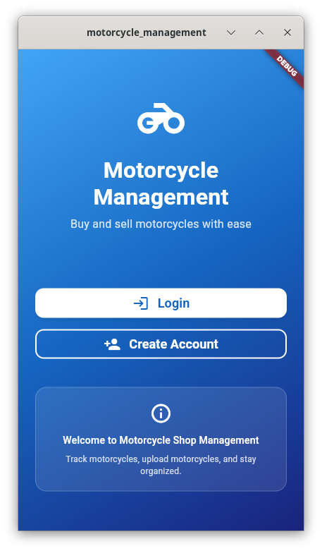

Landing screen with:

* Gradient background
* App title and description
* Login button → ``/login``
* Create Account button → ``/user``

Login Page (login.dart)
-----------------------

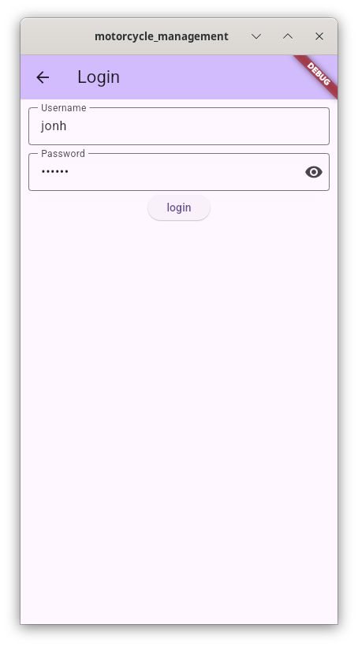

Login form:

* Username field
* Password field with visibility toggle
* Login button → POST /auth/login
* Error handling with SnackBar

Registration (user.dart)
------------------------

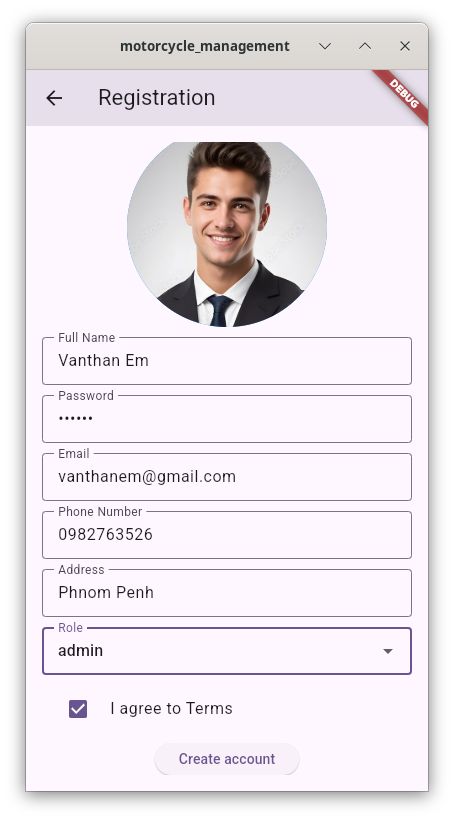

Registration form with:

* Full name
* Password
* Email
* Phone number
* Address
* Role dropdown (customer/admin/guest)
* Profile image picker
* Register button → POST /user

Home Tab (tab/home.dart)
------------------------

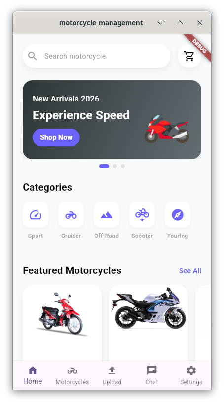

Features:

* Search bar (submits to SearchResultScreen)
* Cart icon button
* Promo carousel (auto-scroll every 5s)
* Categories (Sport, Cruiser, Off-Road, Scooter, Touring)
* Featured motorcycles horizontal scroll
* Most popular section
* Recommended grid (2 columns)

Motorcycles Tab (tab/motorcycle.dart)
-------------------------------------

.. image:: ./_static/screenshot/motorcycle.png
   :width: 300px
   :alt: alternate text
   :align: center

**ProductGridScreen**

2-column grid of product cards:

* Fetches products from GET /product
* Shows loading spinner
* Each card: image, name, price

**ProductCard**

* GestureDetector for tap
* Hero animation for image
* Border decoration
* Price formatted with formatPrice()

**ProductDetailScreen**

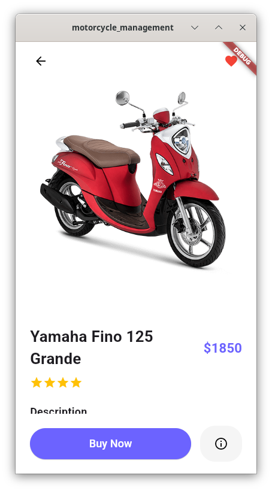

* Large image with Hero animation
* Back button (circle)
* Favorite toggle button
* Product name and price
* Star rating (from calculateStars())
* Description
* Buy Now button → adds to cart
* Info button → shows specifications dialog

**Specifications Dialog**

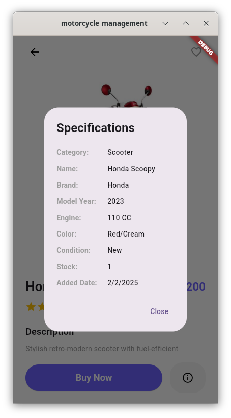

Shows in popup:

* Category name (fetched from /category)
* Name, Brand, Model Year
* Engine CC, Color, Condition
* Stock quantity
* Added date

Upload Tab (tab/upload.dart)
----------------------------

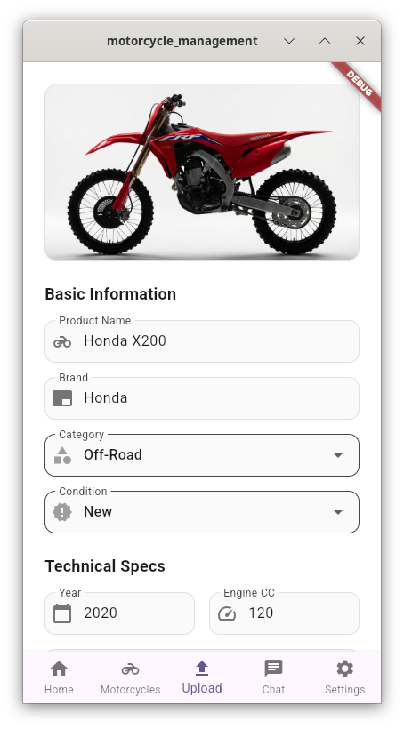

Form for adding new motorcycles:

* Image picker (tap container)
* Name, Brand, Description
* Category dropdown (fetched from /category)
* Condition dropdown (New/Used)
* Model Year, Engine CC, Color
* Price, Stock
* Upload button → POST /product

All fields validated (required).

Chat Tab (tab/chat.dart)
------------------------

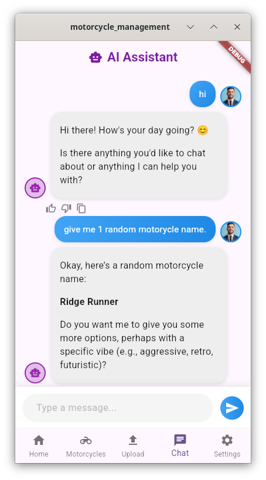

AI chat interface:

* Message list (user + bot)
* User messages: blue gradient, right side
* Bot messages: grey, left side, markdown
* Thinking indicator with spinner
* Streaming text display
* Text input field
* Send/stop button

Message actions (bot messages only):

* Like button (green when selected)
* Dislike button (red when selected)
* Copy to clipboard

Uses SSE (Server-Sent Events) for streaming responses.

Settings Tab (tab/setting.dart)
-------------------------------

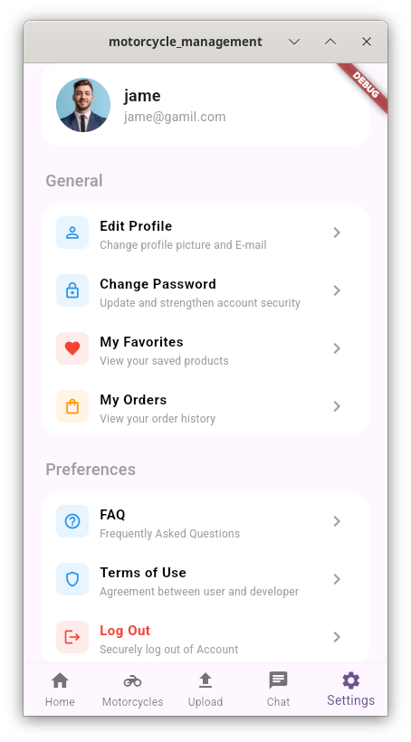

**ProfileSettingScreen**

Profile header:

* Avatar image
* Full name
* Email

General section:

* Edit Profile → EditProfileScreen
* Change Password → ChangePasswordScreen
* My Favorites → FavoritesScreen
* My Orders → OrdersListScreen

Preferences section:

* FAQ → FAQScreen
* Terms of Use → AlertDialog
* Logout → confirmation dialog

**ChangePasswordScreen**

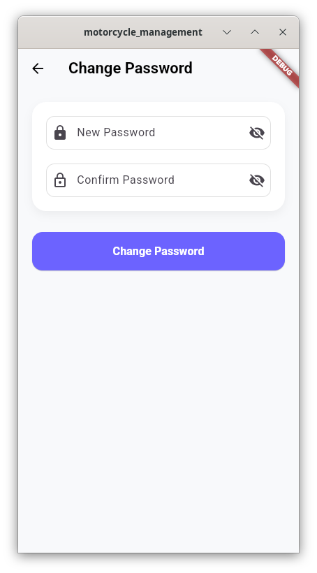

* New password field
* Confirm password field
* Change button → PUT /user/{id}

**OrdersListScreen**

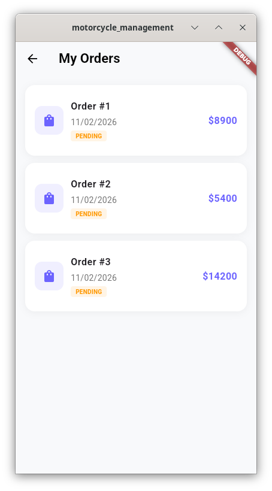

* List of user orders
* Order number, date, status, total
* Status badge (orange for pending, green for completed)
* Tap → OrderDetailScreen

**OrderDetailScreen**

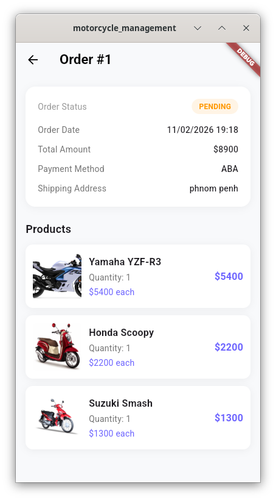

* Order status
* Order date, total, payment method, shipping address
* Products in order (with images)

**FAQScreen**

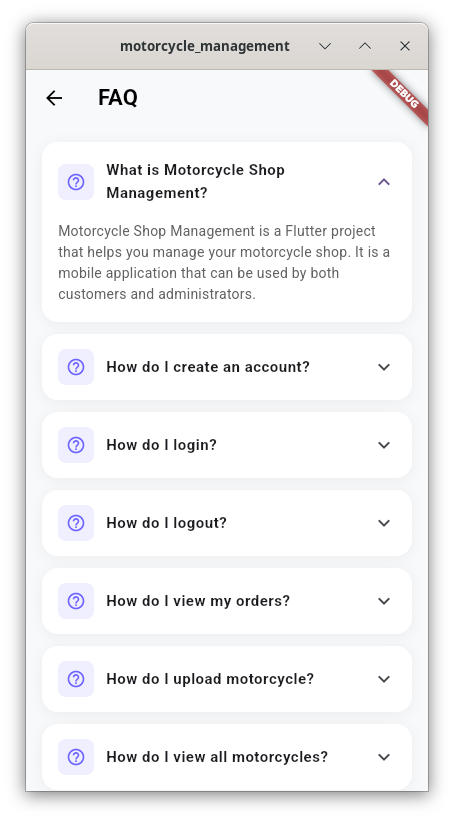

* Expandable list of FAQ items
* Question and answer format

**Terms Dialog**

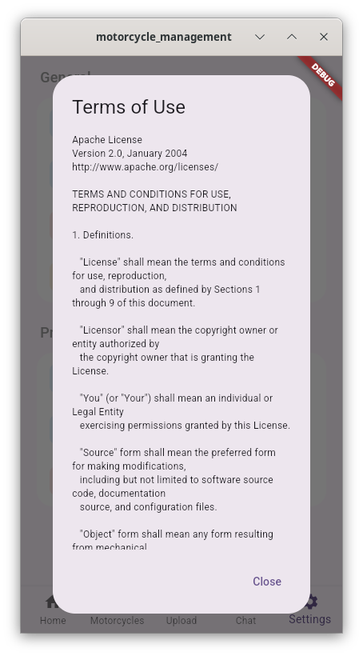

* Shows Apache License 2.0 text
* Scrollable content

Cart Screen (tab/cart_screen.dart)
----------------------------------

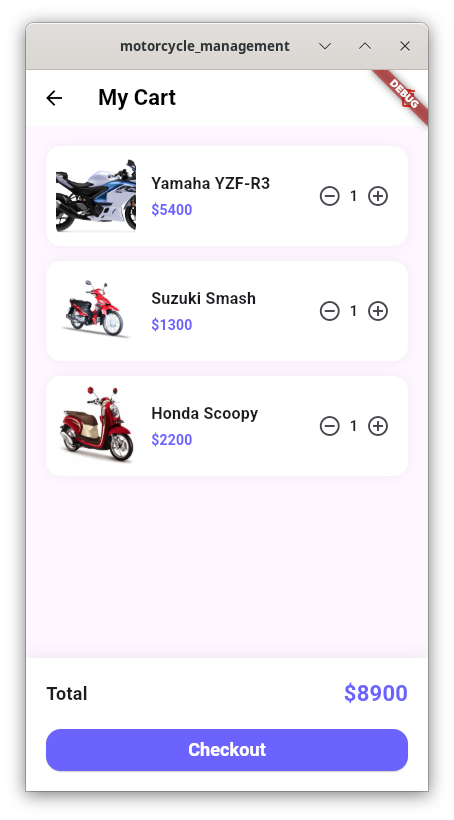

Shopping cart:

* List of cart items
* Product image, name, price
* Quantity buttons (+/-)
* Remove from cart
* Clear cart button (in app bar)
* Total amount
* Checkout button → POST /order

Favorites Screen (tab/favorites_screen.dart)
--------------------------------------------

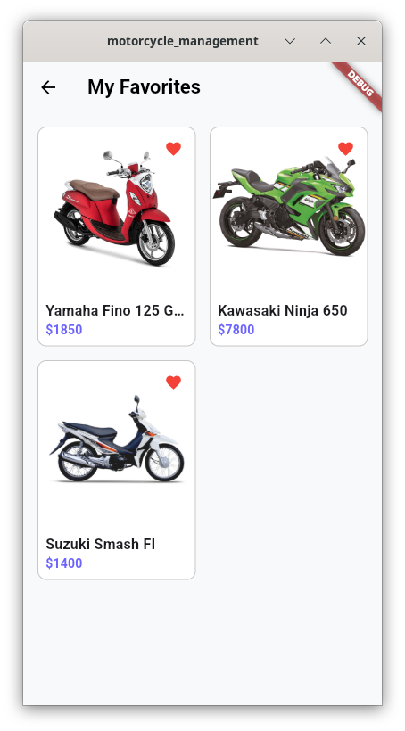

* 2-column grid of favorites
* Heart icon to remove
* Empty state with icon and text
* Tap → ProductDetailScreen

Edit Profile (tab/edit_profile.dart)
------------------------------------

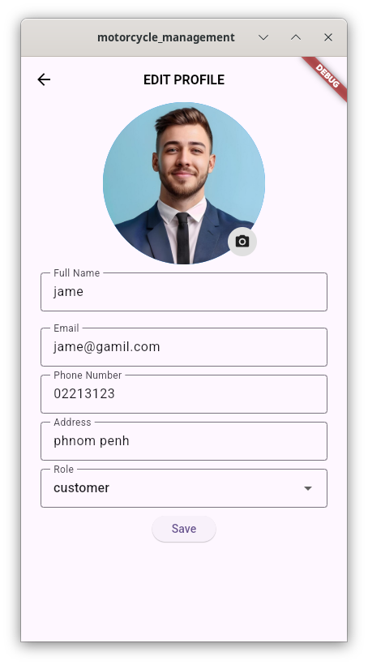

Form with:

* Profile image (tap to change)
* Full name
* Email
* Phone number
* Address
* Role dropdown
* Save button → PUT /user/{id}